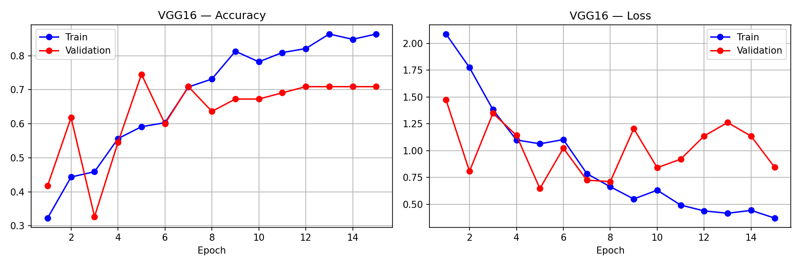
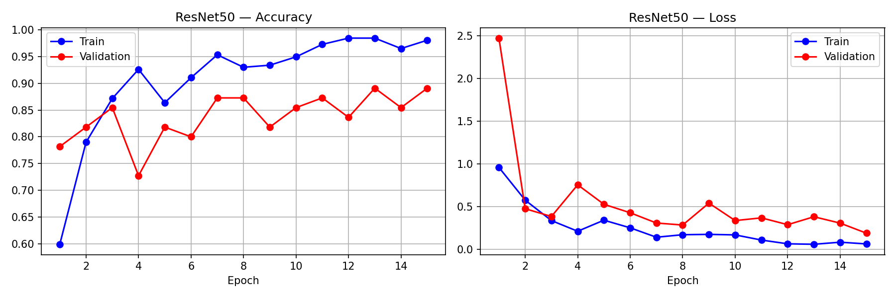
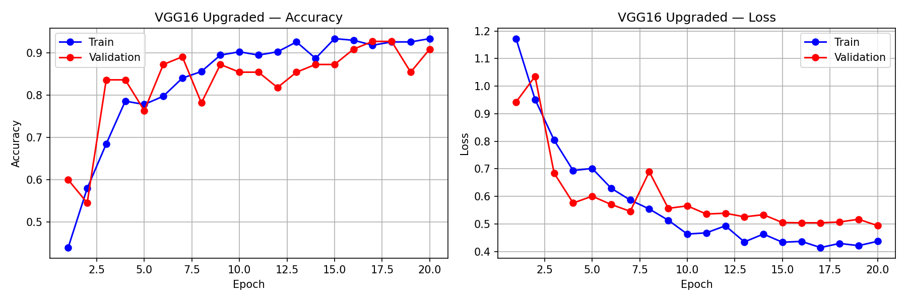
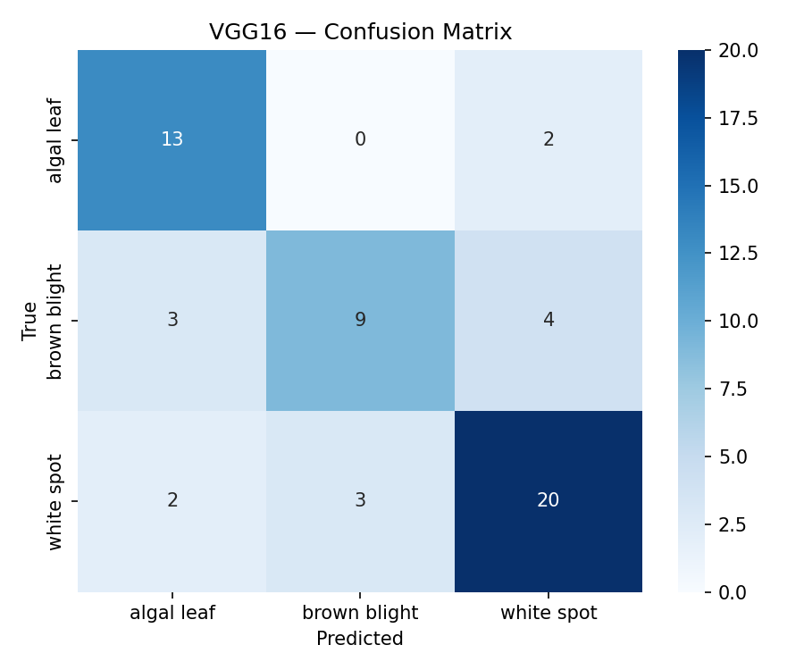
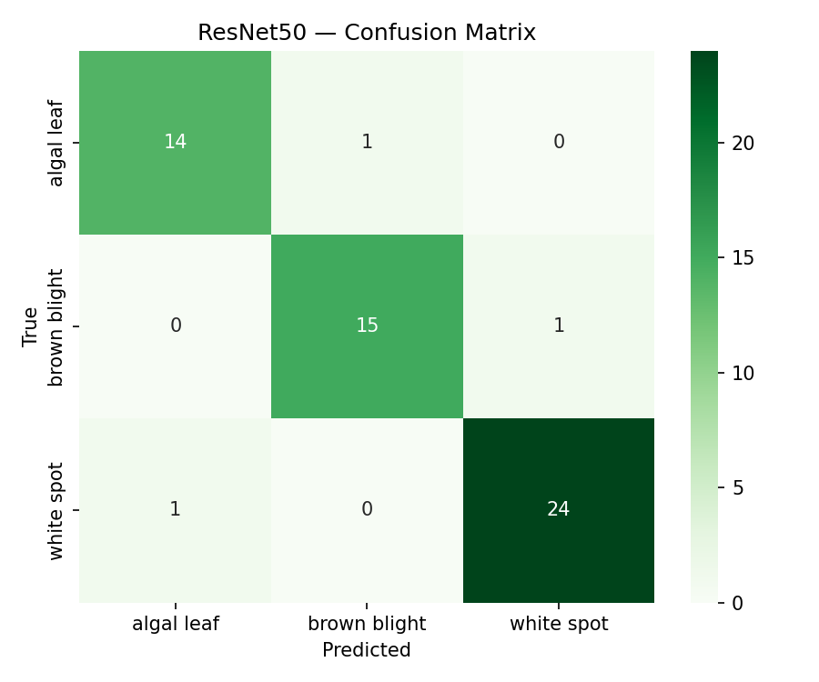
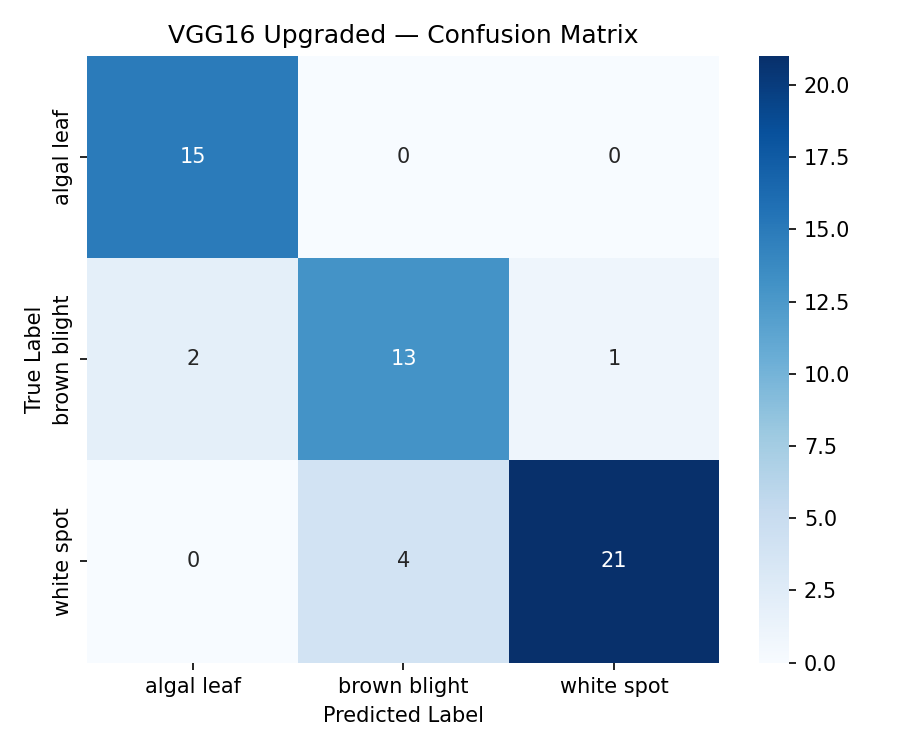

# Tea Leaf Disease Classification Using CNN Transfer Learning

**Course:** CSC4093/DSC4213 — Deep Learning (2024/25)  
**Assignment:** Programming Assignment 02 — Convolutional Networks and Transfer Learning  
**Framework:** PyTorch | **Dataset:** 300 images, 3 classes | **Split:** 70/15/15  
**Hardware:** CPU (Apple macOS)

---

## Overview

This report evaluates three convolutional neural network (CNN) architectures for automated tea leaf disease classification using transfer learning with ImageNet pretrained weights:

- **VGG16 Baseline** — fully frozen feature extractor, linear classifier head
- **ResNet50** — partially fine-tuned with residual skip connections
- **VGG16 Upgraded** — partially fine-tuned VGG16 with custom residual head, batch normalization, and label smoothing

The dataset comprises 300 RGB images across three disease classes — **algal leaf**, **brown blight**, and **white spot** — with 100 images per class. Images were resized to 224×224 pixels. Data augmentation (random horizontal/vertical flips, ±15° rotation, colour jitter) was applied during training to improve generalization on the small dataset.

**Key Result:** ResNet50 achieved the best test accuracy of **95%** (macro F1 = 0.94), followed by VGG16 Upgraded at **88%** (+13% over the VGG16 Baseline of 75%).

---

## 1. Dataset & Preprocessing

| Property | Value |
|---|---|
| Total Images | 300 |
| Classes | Algal Leaf, Brown Blight, White Spot |
| Images per Class | 100 |
| Input Resolution | 224 × 224 RGB |
| Train / Val / Test Split | 70% / 15% / 15% (fixed seed) |
| Training Augmentation | Random flip, rotation ±15°, colour jitter |
| Normalization | ImageNet mean & std (μ=[0.485, 0.456, 0.406], σ=[0.229, 0.224, 0.225]) |

---

## 2. Model Architectures

### 2.1 VGG16 Baseline

All convolutional layers were frozen. Only the final classifier layer was replaced with a linear projection to 3 output classes. No regularization was added to the classifier head. This model represents the simplest transfer learning strategy — feature extraction only, with no domain adaptation of the convolutional backbone.

### 2.2 ResNet50

The first three layer groups (`layer1`–`layer3`) were frozen, and `layer4` was unfrozen for fine-tuning. The fully connected head was replaced with a Dropout(0.4) + Linear(2048 → 3) block. Built-in residual skip connections and batch normalization in ResNet50's architecture inherently support stable gradient flow during fine-tuning.

### 2.3 VGG16 Upgraded

Convolutional blocks 1–3 were frozen and blocks 4–5 were unfrozen for fine-tuning. The classifier head was rebuilt as a custom residual block: Linear(25088 → 2048) → BatchNorm → ReLU → Dropout(0.5) → Linear(2048 → 1024) → BatchNorm → ReLU → Dropout(0.3) → Linear(1024 → 3), with a residual skip connection across the head. Label smoothing (ε = 0.10) was applied to the loss function, and differential learning rates were used (lower LR for unfrozen conv layers, higher LR for the new head).

### 2.4 Configuration Summary

| Property | VGG16 Baseline | ResNet50 | VGG16 Upgraded |
|---|---|---|---|
| Pretrained Weights | ImageNet | ImageNet | ImageNet |
| Frozen Layers | All conv layers | Conv blocks 1–3 | Conv blocks 1–3 |
| Fine-tuned Layers | None | Layer4 + FC | Conv blocks 4–5 + Head |
| Residual Connections | No | Yes (built-in) | Yes (custom) |
| Batch Normalization | No | Yes (built-in) | Yes (added) |
| Dropout | None | 0.40 | 0.30 – 0.50 |
| Label Smoothing | None | None | 0.10 |
| Optimizer | Adam lr=1e-3 | Adam lr=1e-3 | Adam (differential LRs) |
| LR Scheduler | StepLR (γ=0.5) | StepLR (γ=0.5) | CosineAnnealingLR |
| Epochs | 15 | 15 | 20 |
| Training Time | 12m 07s | 13m 21s | 18m 57s |

---

## 3. Training Performance

### 3.1 VGG16 Baseline



Training accuracy increased from ~32% to ~86% over 15 epochs; however, validation accuracy plateaued around 70–71% from epoch 8 onward. Validation loss remained volatile throughout (oscillating 0.65–1.25), indicating the frozen convolutional backbone failed to generalize beyond what fixed ImageNet features could represent for tea leaf textures. The growing gap between training and validation accuracy is a clear sign of underfitting in the feature extraction regime.

### 3.2 ResNet50



ResNet50 converged rapidly, surpassing 92% training accuracy by epoch 3 and exceeding 98% by epoch 11. Validation accuracy stabilized in the 83–89% range, ending at ~89% at epoch 15. Both training and validation loss declined steadily toward near zero — demonstrating effective transfer learning with minimal overfitting. The small train–validation gap is consistent with the partially unfrozen architecture enabling meaningful domain adaptation.

### 3.3 VGG16 Upgraded



Early training was volatile (~44% accuracy at epoch 1), which is expected when deeper convolutional blocks adapt simultaneously. From epoch 5 onward, training stabilized — reaching ~94% training accuracy and ~91–93% validation accuracy by epoch 20. Both loss curves declined steadily after epoch 5, with validation loss stabilizing around 0.50. This is a considerably healthier convergence pattern than the VGG16 Baseline and demonstrates the benefit of partial fine-tuning combined with Cosine Annealing.

---

## 4. Test Set Results

All metrics were computed on the held-out test set of **56 images** (15 algal leaf, 16 brown blight, 25 white spot).

### 4.1 Overall Performance

| Model | Test Accuracy | Macro Precision | Macro Recall | Macro F1 | Training Time |
|---|---|---|---|---|---|
| VGG16 Baseline | 75% | 0.75 | 0.74 | 0.74 | 12m 07s |
| ResNet50 | **95%** | **0.94** | **0.94** | **0.94** | 13m 21s |
| VGG16 Upgraded | 88% | 0.87 | 0.88 | 0.87 | 18m 57s |

### 4.2 Per-Class Metrics

| Model | Class | Precision | Recall | F1-Score | Support |
|---|---|---|---|---|---|
| **VGG16 Baseline** | Algal Leaf | 0.72 | 0.87 | 0.79 | 15 |
| | Brown Blight | 0.75 | 0.56 | 0.64 | 16 |
| | White Spot | 0.77 | 0.80 | 0.78 | 25 |
| | **Macro Avg** | **0.75** | **0.74** | **0.74** | **56** |
| **ResNet50** | Algal Leaf | 0.93 | 0.93 | 0.93 | 15 |
| | Brown Blight | 0.94 | 0.94 | 0.94 | 16 |
| | White Spot | 0.96 | 0.96 | 0.96 | 25 |
| | **Macro Avg** | **0.94** | **0.94** | **0.94** | **56** |
| **VGG16 Upgraded** | Algal Leaf | 0.88 | 1.00 | 0.94 | 15 |
| | Brown Blight | 0.76 | 0.81 | 0.79 | 16 |
| | White Spot | 0.95 | 0.84 | 0.89 | 25 |
| | **Macro Avg** | **0.87** | **0.88** | **0.87** | **56** |

### 4.3 Confusion Matrix Analysis

#### VGG16 Baseline



14 total misclassifications out of 56 samples. Brown blight was the most problematic class — only 9/16 correctly identified, with 3 misclassified as algal leaf and 4 as white spot. This suggests that frozen VGG16 ImageNet features lacked the discriminative capacity to separate the subtle textural differences between the three disease types.

#### ResNet50



Only 3 total misclassifications — 1 per class. This near-perfect, evenly distributed error pattern confirms that fine-tuning ResNet50's last residual block enabled strong domain adaptation, with the model learning robust disease-discriminative features from leaf texture and discoloration patterns.

#### VGG16 Upgraded



7 total misclassifications. The upgraded model achieved **perfect algal leaf classification (15/15)**, completely eliminating all algal leaf errors present in the baseline. Brown blight had 2 misclassifications (as algal leaf) and white spot had 4 (as brown blight), indicating that the brown blight–white spot decision boundary remains the primary remaining challenge for VGG-based architectures on this dataset.

---

## 5. Discussion

### 5.1 Why ResNet50 Outperformed VGG16

ResNet50's performance advantage stems from two compounding factors. First, its built-in residual skip connections allow gradients to flow directly across multiple layers during backpropagation, preventing vanishing gradient degradation when fine-tuning deep layers. Second, fine-tuning `layer4` exposed the model's highest-level convolutional features to the tea leaf disease domain, enabling it to learn disease-specific texture and colour representations that generic ImageNet features alone cannot capture.

### 5.2 Impact of Architectural Upgrades on VGG16

The VGG16 Upgraded model demonstrated that a +13 percentage point improvement over the baseline can be attributed to three targeted interventions:

- **Unfreezing conv blocks 4–5** — allowing later layers to adapt to disease texture features
- **Custom residual head** — providing skip connections across the dense classifier, improving gradient flow
- **Label smoothing + CosineAnnealingLR** — reducing overconfidence and enabling finer convergence

Despite these improvements, the remaining 7-point gap between VGG16 Upgraded and ResNet50 reflects the fundamental architectural advantage of residual connections throughout the entire backbone, not just at the classifier head.

### 5.3 Brown Blight as the Hardest Class

Across all three models, brown blight consistently had the lowest F1-score (0.64 baseline, 0.79 upgraded, 0.94 ResNet50). This class likely shares visual characteristics with both algal leaf (similar discoloration tones) and white spot (similar lesion morphology), making it the hardest to discriminate at the feature level with only 100 training samples per class.

---

## 6. Conclusion

ResNet50 is the recommended architecture for tea leaf disease classification among those evaluated, achieving **95% test accuracy** and a macro F1-score of 0.94. The study confirms that:

1. Freezing all convolutional layers is a suboptimal transfer learning strategy for domain-specific fine-grained image classification
2. Partial fine-tuning of deeper convolutional layers substantially improves domain adaptation
3. Residual connections — whether built-in (ResNet50) or custom-added (VGG16 Upgraded) — measurably improve gradient flow and classification performance
4. ResNet50's architecture provides a stronger inductive bias for this task than VGG16 variants, even with equivalent fine-tuning strategies

Future work could explore EfficientNet-based architectures, mixup augmentation, or ensemble methods to further improve robustness on the brown blight class.

---

## Appendix: Reproduction Notes

```
Dataset Split Seed : 42
Batch Size         : 16
Image Size         : 224 × 224
Normalization      : mean=[0.485, 0.456, 0.406], std=[0.229, 0.224, 0.225]
VGG16 Baseline     : torchvision.models.vgg16(pretrained=True)
ResNet50           : torchvision.models.resnet50(pretrained=True)
VGG16 Upgraded     : torchvision.models.vgg16(pretrained=True) + custom residual head
```

